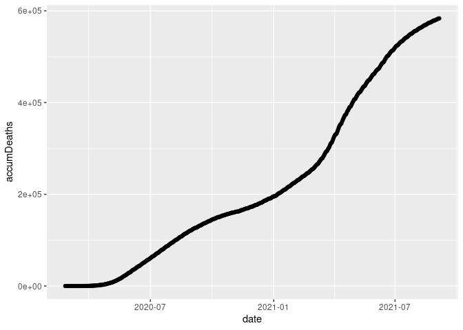

<!-- README.md is generated from README.Rmd. Please edit that file -->

# covid19br

<!-- badges: start -->
<!-- badges: end -->

The goal of the package is to provide a function to automatically import
the Brazilian COVID-19 pandemic data into R. Brazilian data is available
on country, region, state, and city levels, and are downloaded from the
official Brazilian repository at &lt;<https://covid.saude.gov.br/>&gt;.
The package also enables one to download the world-level COVID-19 data
from the Johns Hopkins University’s repository at
&lt;<https://github.com/CSSEGISandData/COVID-19>&gt;.

## Installation

You can install the released version of covid19br from
[CRAN](https://CRAN.R-project.org) with:

``` r
install.packages("covid19br")
```

And the development version from [GitHub](https://github.com/) with:

``` r
# install.packages("devtools")
devtools::install_github("fndemarqui/covid19br")
```

## Example

This is a basic example which shows you how to solve a common problem:

``` r
library(covid19br)
library(tidyverse)

brazil <- downloadCovid19("brazil")

ggplot(brazil, aes(x = date, y = accumDeaths)) +
  geom_point() +
  geom_path()
```


